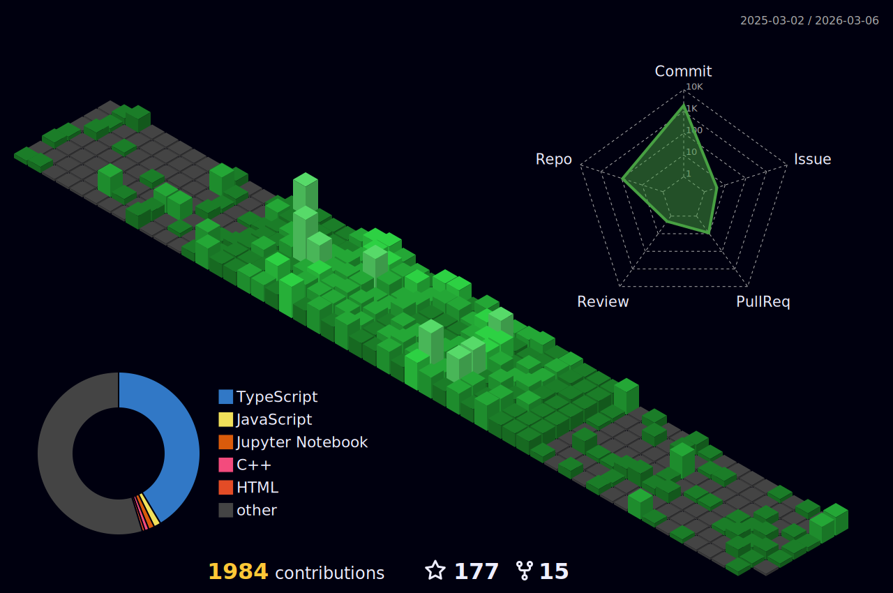

<h1 align="center">
  
</h1>

<div align="center">
  <a href="https://krajtilak.vercel.app/" title="Portfolio"></a>
  <a href="https://www.linkedin.com/in/krajtilak2020" title="LinkedIn"></a>
  <a href="https://x.com/2020rajtilak" title="X (Twitter)"></a>
  <a href="https://instagram.com/k.raj_tilak2020" title="Instagram"></a>
  <a href="https://stackoverflow.com/users/26817244"></a>
  <a href="https://codepen.io/K-Rajtilak"></a>
  <a href="https://www.facebook.com/profile.php?id=100073801447447"></a>
</div>

## 👨🏻‍💻 About Me


```javascript
const krajtilak = {
    Education: "BTech CSE - Cyber Defence",
    Passion: ["Web Development", "Cyber-Security", "IoT"],
    Website: "krajtilak.vercel.app",
    Focused: "True"
};
```
<p align="left">
  A passionate <b>Cyber Security</b> student, I strive to bridge the gap between innovative ideas and transformative technologies. My expertise includes <b>Web Development</b>, <b>Cyber Security</b>, <b>IoT</b>, and <b>Collaborative GitHub Projects</b>.
</p>

## 🛠️ Technologies & Tools
<div align="center">
  
</div>

## 📊 GitHub Statistics



<div align="center">
  
</div>

## ⌨️ My Coding Stats

<!--START_SECTION:waka-->


**🐱 My GitHub Data** 

> 📦 4.0 MB Used in GitHub's Storage 
 > 
> 🏆 2,017 Contributions in the Year 2025
 > 
> 🚫 Not Opted to Hire
 > 
> 📜 94 Public Repositories 
 > 
> 🔑 5 Private Repositories 
 > 
**I'm an Early 🐤** 

```text
🌞 Morning                509 commits         ██████░░░░░░░░░░░░░░░░░░░   23.08 % 
🌆 Daytime                735 commits         ████████░░░░░░░░░░░░░░░░░   33.33 % 
🌃 Evening                599 commits         ███████░░░░░░░░░░░░░░░░░░   27.17 % 
🌙 Night                  362 commits         ████░░░░░░░░░░░░░░░░░░░░░   16.42 % 
```
📅 **I'm Most Productive on Friday** 

```text
Monday                   295 commits         ███░░░░░░░░░░░░░░░░░░░░░░   13.38 % 
Tuesday                  280 commits         ███░░░░░░░░░░░░░░░░░░░░░░   12.70 % 
Wednesday                352 commits         ████░░░░░░░░░░░░░░░░░░░░░   15.96 % 
Thursday                 302 commits         ███░░░░░░░░░░░░░░░░░░░░░░   13.70 % 
Friday                   416 commits         █████░░░░░░░░░░░░░░░░░░░░   18.87 % 
Saturday                 275 commits         ███░░░░░░░░░░░░░░░░░░░░░░   12.47 % 
Sunday                   285 commits         ███░░░░░░░░░░░░░░░░░░░░░░   12.93 % 
```


📊 **This Week I Spent My Time On** 

```text
🕑︎ Time Zone: Asia/Kolkata

💬 Programming Languages: 
TypeScript               7 hrs 32 mins       ███████████████░░░░░░░░░░   60.53 % 
JavaScript               2 hrs 35 mins       █████░░░░░░░░░░░░░░░░░░░░   20.83 % 
Text                     30 mins             █░░░░░░░░░░░░░░░░░░░░░░░░   04.10 % 
Bash                     28 mins             █░░░░░░░░░░░░░░░░░░░░░░░░   03.87 % 
CSS                      20 mins             █░░░░░░░░░░░░░░░░░░░░░░░░   02.74 % 

🔥 Editors: 
VS Code                  12 hrs 27 mins      █████████████████████████   100.00 % 

🐱‍💻 Projects: 
Portfolio-V5             7 hrs 6 mins        ██████████████░░░░░░░░░░░   57.07 % 
Netra-Dashboard          1 hr 39 mins        ███░░░░░░░░░░░░░░░░░░░░░░   13.33 % 
MAYA-The_illusion_of_trut1 hr 36 mins        ███░░░░░░░░░░░░░░░░░░░░░░   12.87 % 
Portfolio-V5-Release_Note1 hr 18 mins        ███░░░░░░░░░░░░░░░░░░░░░░   10.54 % 
Mayav1                   30 mins             █░░░░░░░░░░░░░░░░░░░░░░░░   04.10 % 

💻 Operating System: 
Windows                  10 hrs 43 mins      ██████████████████████░░░   86.13 % 
Linux                    1 hr 43 mins        ███░░░░░░░░░░░░░░░░░░░░░░   13.87 % 
```

**I Mostly Code in TypeScript** 

```text
TypeScript               15 repos            ██████░░░░░░░░░░░░░░░░░░░   22.06 % 
JavaScript               12 repos            ████░░░░░░░░░░░░░░░░░░░░░   17.65 % 
C++                      6 repos             ██░░░░░░░░░░░░░░░░░░░░░░░   08.82 % 
Jupyter Notebook         4 repos             █░░░░░░░░░░░░░░░░░░░░░░░░   05.88 % 
Java                     3 repos             █░░░░░░░░░░░░░░░░░░░░░░░░   04.41 % 
```


**Timeline**


 Last Updated on 29/10/2025 18:51:16 UTC
<!--END_SECTION:waka-->


## 🏆 GitHub Trophies
<div align="center">
  
</div>

## ✍️ Random Dev Quote
<div align="center">
  
</div>


## ☕️ Support My Work
<div align="left">
  <a href="https://buymeacoffee.com/k.raj_tilak2020">
    
  </a>
</div>

<p align="right">
  
</p>
