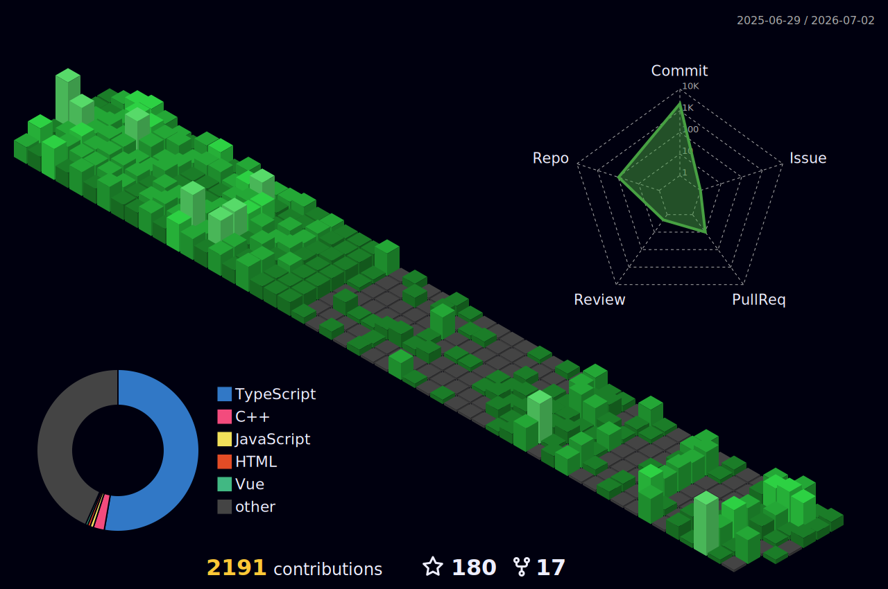

<h1 align="center">
  
</h1>

<div align="center">
  <a href="https://krajtilak.vercel.app/" title="Portfolio"></a>
  <a href="https://www.linkedin.com/in/krajtilak2020" title="LinkedIn"></a>
  <a href="https://x.com/2020rajtilak" title="X (Twitter)"></a>
  <a href="https://instagram.com/k.raj_tilak2020" title="Instagram"></a>
  <a href="https://stackoverflow.com/users/26817244"></a>
  <a href="https://codepen.io/K-Rajtilak"></a>
  <a href="https://www.facebook.com/profile.php?id=100073801447447"></a>
</div>

## 👨🏻‍💻 About Me


```javascript
const krajtilak = {
    Education: "BTech CSE - Cyber Defence",
    Passion: ["Web Development", "Cyber-Security", "IoT"],
    Website: "krajtilak.dev",
    Focused: "True"
};
```
<p align="left">
  A passionate <b>Cyber Security</b> student, I strive to bridge the gap between innovative ideas and transformative technologies. My expertise includes <b>Web Development</b>, <b>Cyber Security</b>, <b>IoT</b>, and <b>Collaborative GitHub Projects</b>.
</p>

## 🛠️ Technologies & Tools
<div align="center">
  
</div>

## 📊 GitHub Statistics



<div align="center">
  
</div>

## ⌨️ My Coding Stats

<!--START_SECTION:waka-->


**🐱 My GitHub Data** 

> 📦 4.3 MB Used in GitHub's Storage 
 > 
> 🏆 225 Contributions in the Year 2026
 > 
> 🚫 Not Opted to Hire
 > 
> 📜 131 Public Repositories 
 > 
> 🔑 12 Private Repositories 
 > 
**I'm an Early 🐤** 

```text
🌞 Morning                466 commits         ██████░░░░░░░░░░░░░░░░░░░   24.96 % 
🌆 Daytime                663 commits         █████████░░░░░░░░░░░░░░░░   35.51 % 
🌃 Evening                508 commits         ███████░░░░░░░░░░░░░░░░░░   27.21 % 
🌙 Night                  230 commits         ███░░░░░░░░░░░░░░░░░░░░░░   12.32 % 
```
📅 **I'm Most Productive on Friday** 

```text
Monday                   236 commits         ███░░░░░░░░░░░░░░░░░░░░░░   12.64 % 
Tuesday                  251 commits         ███░░░░░░░░░░░░░░░░░░░░░░   13.44 % 
Wednesday                246 commits         ███░░░░░░░░░░░░░░░░░░░░░░   13.18 % 
Thursday                 243 commits         ███░░░░░░░░░░░░░░░░░░░░░░   13.02 % 
Friday                   376 commits         █████░░░░░░░░░░░░░░░░░░░░   20.14 % 
Saturday                 262 commits         ████░░░░░░░░░░░░░░░░░░░░░   14.03 % 
Sunday                   253 commits         ███░░░░░░░░░░░░░░░░░░░░░░   13.55 % 
```


📊 **This Week I Spent My Time On** 

```text
🕑︎ Time Zone: Asia/Kolkata

💬 Programming Languages: 
TypeScript               0 secs              █████████████████████████   100.00 % 

🔥 Editors: 
VS Code                  0 secs              █████████████████████████   100.00 % 

🐱‍💻 Projects: 
Portfolio-V5             0 secs              █████████████████████████   100.00 % 

💻 Operating System: 
Windows                  0 secs              █████████████████████████   100.00 % 
```

**I Mostly Code in TypeScript** 

```text
TypeScript               23 repos            ███████░░░░░░░░░░░░░░░░░░   28.05 % 
JavaScript               16 repos            █████░░░░░░░░░░░░░░░░░░░░   19.51 % 
C++                      9 repos             ███░░░░░░░░░░░░░░░░░░░░░░   10.98 % 
CSS                      8 repos             ██░░░░░░░░░░░░░░░░░░░░░░░   09.76 % 
Shell                    1 repo              ░░░░░░░░░░░░░░░░░░░░░░░░░   01.22 % 
```


**Timeline**


 Last Updated on 23/04/2026 19:52:26 UTC
<!--END_SECTION:waka-->


## 🏆 GitHub Trophies
<div align="center">
  
</div>

## ✍️ Random Dev Quote
<div align="center">
  
</div>


## ☕️ Support My Work
<div align="left">
  <a href="https://buymeacoffee.com/k.raj_tilak2020">
    
  </a>
</div>

<p align="right">
  
</p>
