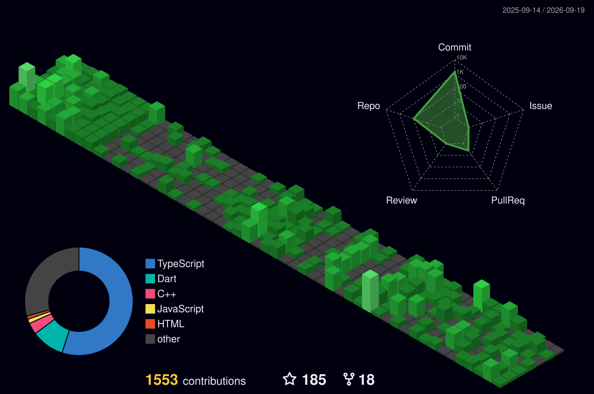

<h1 align="center">
  
</h1>

<div align="center">
  <a href="https://krajtilak.in" title="Portfolio"></a>
  <a href="https://www.linkedin.com/in/krajtilak2020" title="LinkedIn"></a>
  <a href="https://x.com/2020rajtilak" title="X (Twitter)"></a>
  <a href="https://instagram.com/k.raj_tilak2020" title="Instagram"></a>
</div>

## 👨🏻‍💻 About Me


```javascript
const krajtilak = {
    Education: "BTech CSE - Cyber Defence",
    Passion: ["Web Development", "Cyber-Security", "IoT"],
    Website: "krajtilak.in",
};
```
<p align="left">
  A passionate <b>Cyber Security</b> student, I strive to bridge the gap between innovative ideas and transformative technologies. My expertise includes <b>Web Development</b>, <b>Cyber Security</b>, <b>IoT</b>, and <b>Collaborative GitHub Projects</b>.
</p>

## 🛠️ Technologies & Tools
<div align="center">
  
</div>

## 📊 GitHub Statistics



## ⌨️ My Coding Stats

<!--START_SECTION:waka-->


**🐱 My GitHub Data** 

> 📦 4.5 MB Used in GitHub's Storage 
 > 
> 🏆 665 Contributions in the Year 2026
 > 
> 🚫 Not Opted to Hire
 > 
> 📜 147 Public Repositories 
 > 
> 🔑 25 Private Repositories 
 > 
**I'm an Early 🐤** 

```text
🌞 Morning                578 commits         █████░░░░░░░░░░░░░░░░░░░░   19.98 % 
🌆 Daytime                1008 commits        █████████░░░░░░░░░░░░░░░░   34.84 % 
🌃 Evening                825 commits         ███████░░░░░░░░░░░░░░░░░░   28.52 % 
🌙 Night                  482 commits         ████░░░░░░░░░░░░░░░░░░░░░   16.66 % 
```
📅 **I'm Most Productive on Friday** 

```text
Monday                   433 commits         ████░░░░░░░░░░░░░░░░░░░░░   14.97 % 
Tuesday                  368 commits         ███░░░░░░░░░░░░░░░░░░░░░░   12.72 % 
Wednesday                408 commits         ████░░░░░░░░░░░░░░░░░░░░░   14.10 % 
Thursday                 367 commits         ███░░░░░░░░░░░░░░░░░░░░░░   12.69 % 
Friday                   522 commits         █████░░░░░░░░░░░░░░░░░░░░   18.04 % 
Saturday                 402 commits         ███░░░░░░░░░░░░░░░░░░░░░░   13.90 % 
Sunday                   393 commits         ███░░░░░░░░░░░░░░░░░░░░░░   13.58 % 
```


📊 **This Week I Spent My Time On** 

```text
🕑︎ Time Zone: Asia/Kolkata

💬 Programming Languages: 
TypeScript               1 hr 5 mins         ███████████░░░░░░░░░░░░░░   42.27 % 
Dart                     41 mins             ███████░░░░░░░░░░░░░░░░░░   26.83 % 
HTML                     18 mins             ███░░░░░░░░░░░░░░░░░░░░░░   11.61 % 
Markdown                 14 mins             ██░░░░░░░░░░░░░░░░░░░░░░░   09.23 % 
JavaScript               11 mins             ██░░░░░░░░░░░░░░░░░░░░░░░   07.70 % 

🔥 Editors: 
Antigravity IDE          2 hrs 13 mins       █████████████████████░░░░   85.59 % 
VS Code                  22 mins             ████░░░░░░░░░░░░░░░░░░░░░   14.41 % 

🐱‍💻 Projects: 
Odrocon                  1 hr 27 mins        ██████████████░░░░░░░░░░░   56.10 % 
nummo                    47 mins             ████████░░░░░░░░░░░░░░░░░   30.83 % 
iwt                      18 mins             ███░░░░░░░░░░░░░░░░░░░░░░   11.61 % 
Unknown Project          2 mins              ░░░░░░░░░░░░░░░░░░░░░░░░░   01.46 % 

💻 Operating System: 
Windows                  2 hrs 31 mins       ████████████████████████░   97.20 % 
Linux                    4 mins              █░░░░░░░░░░░░░░░░░░░░░░░░   02.80 % 
```

🤖 **AI Coding This Week** 

```text
⏱ AI Coding Time: 1 hr 55 mins (74.02%)

✍️ 248 lines written by AI, 0 lines written by hand (100.0% AI-written)

🔤 70,687 Input Tokens, 251 Output Tokens

💵 $0.22 Estimated AI Cost This Week

🧠 8 AI Sessions, 27 AI Prompts

Gemini                   347 lines           █████████████████████████   98.86 % 
Github-Copilot           4 lines             ░░░░░░░░░░░░░░░░░░░░░░░░░   01.14 % 

🔎 AI Coding Insights:
🤖 AI-Driven — 100.0% of written lines came from AI
📝 Concise Prompter — average 295 characters per prompt
🔁 Iterative Prompter — average 3 prompts per session
🚀 High AI Trust — 13.33% of changed lines were hand-edited
```

**I Mostly Code in TypeScript** 

```text
TypeScript               37 repos            █████████░░░░░░░░░░░░░░░░   34.26 % 
JavaScript               15 repos            ███░░░░░░░░░░░░░░░░░░░░░░   13.89 % 
C++                      11 repos            ███░░░░░░░░░░░░░░░░░░░░░░   10.19 % 
HTML                     10 repos            ██░░░░░░░░░░░░░░░░░░░░░░░   09.26 % 
Dart                     2 repos             ░░░░░░░░░░░░░░░░░░░░░░░░░   01.85 % 
```


**Timeline**


 Last Updated on 29/07/2026 19:57:03 UTC
<!--END_SECTION:waka-->


## ✍️ Random Dev Quote
<div align="center">
  
</div>

---

<p align="right">
  
</p>
