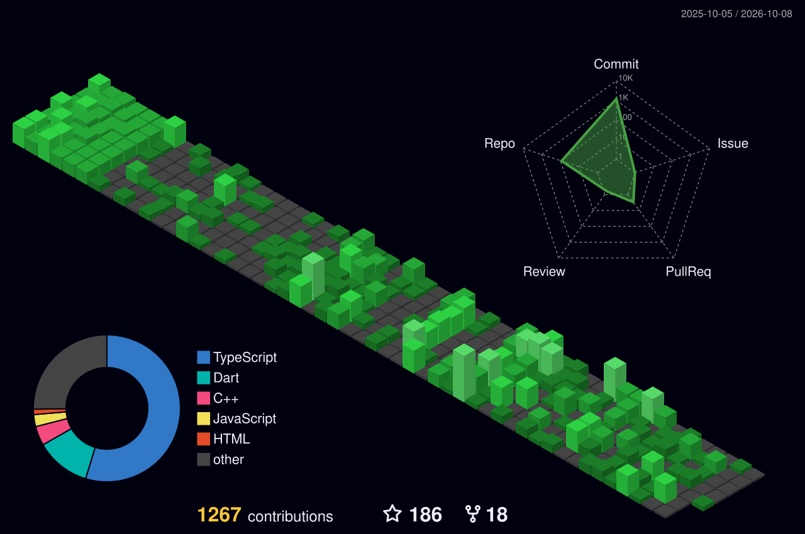

<h1 align="center">
  
</h1>

<div align="center">
  <a href="https://krajtilak.in" title="Portfolio"></a>
  <a href="https://www.linkedin.com/in/krajtilak2020" title="LinkedIn"></a>
  <a href="https://x.com/2020rajtilak" title="X (Twitter)"></a>
  <a href="https://instagram.com/k.raj_tilak2020" title="Instagram"></a>
</div>

## 👨🏻‍💻 About Me


```javascript
const krajtilak = {
    Education: "BTech CSE - Cyber Defence",
    Passion: ["Web Development", "Cyber-Security", "IoT"],
    Website: "krajtilak.in",
};
```
<p align="left">
  A passionate <b>Cyber Security</b> student, I strive to bridge the gap between innovative ideas and transformative technologies. My expertise includes <b>Web Development</b>, <b>Cyber Security</b>, <b>IoT</b>, and <b>Collaborative GitHub Projects</b>.
</p>

## 🛠️ Technologies & Tools
<div align="center">
  
</div>

## 📊 GitHub Statistics



## ⌨️ My Coding Stats

<!--START_SECTION:waka-->


**🐱 My GitHub Data** 

> 📦 4.8 MB Used in GitHub's Storage 
 > 
> 🏆 890 Contributions in the Year 2026
 > 
> 💼 Opted to Hire
 > 
> 📜 150 Public Repositories 
 > 
> 🔑 31 Private Repositories 
 > 
**I'm an Early 🐤** 

```text
🌞 Morning                641 commits         █████░░░░░░░░░░░░░░░░░░░░   18.98 % 
🌆 Daytime                1161 commits        █████████░░░░░░░░░░░░░░░░   34.37 % 
🌃 Evening                1061 commits        ████████░░░░░░░░░░░░░░░░░   31.41 % 
🌙 Night                  515 commits         ████░░░░░░░░░░░░░░░░░░░░░   15.25 % 
```
📅 **I'm Most Productive on Friday** 

```text
Monday                   487 commits         ████░░░░░░░░░░░░░░░░░░░░░   14.42 % 
Tuesday                  413 commits         ███░░░░░░░░░░░░░░░░░░░░░░   12.23 % 
Wednesday                425 commits         ███░░░░░░░░░░░░░░░░░░░░░░   12.58 % 
Thursday                 458 commits         ███░░░░░░░░░░░░░░░░░░░░░░   13.56 % 
Friday                   614 commits         █████░░░░░░░░░░░░░░░░░░░░   18.18 % 
Saturday                 449 commits         ███░░░░░░░░░░░░░░░░░░░░░░   13.29 % 
Sunday                   532 commits         ████░░░░░░░░░░░░░░░░░░░░░   15.75 % 
```


📊 **This Week I Spent My Time On** 

```text
🕑︎ Time Zone: Asia/Kolkata

💬 Programming Languages: 
Other                    1 hr 36 mins        ███████░░░░░░░░░░░░░░░░░░   29.01 % 
JavaScript               1 hr 27 mins        ███████░░░░░░░░░░░░░░░░░░   26.35 % 
TypeScript               33 mins             ██░░░░░░░░░░░░░░░░░░░░░░░   09.94 % 
JSON                     27 mins             ██░░░░░░░░░░░░░░░░░░░░░░░   08.20 % 
Bash                     26 mins             ██░░░░░░░░░░░░░░░░░░░░░░░   07.90 % 

🔥 Editors: 
Antigravity CLI          4 hrs 7 mins        ███████████████████░░░░░░   74.50 % 
VS Code                  1 hr 24 mins        ██████░░░░░░░░░░░░░░░░░░░   25.50 % 

🐱‍💻 Projects: 
mc-bot                   2 hrs 39 mins       ████████████░░░░░░░░░░░░░   48.08 % 
krajtilak                1 hr 52 mins        ████████░░░░░░░░░░░░░░░░░   33.86 % 
GreenAI-2027             1 hr                █████░░░░░░░░░░░░░░░░░░░░   18.06 % 

💻 Operating System: 
Linux                    5 hrs 32 mins       █████████████████████████   100.00 % 
```

🤖 **AI Coding This Week** 

```text
⏱ AI Coding Time: 5 hrs 7 mins (92.57%)

✍️ 248 lines written by AI, 1 lines written by hand (99.6% AI-written)

🔤 11,032,209 Input Tokens, 326,199 Output Tokens

💵 $14.09 Estimated AI Cost This Week

🧠 11 AI Sessions, 80 AI Prompts

Gemini                   248 lines           █████████████████████████   100.00 % 

🔎 AI Coding Insights:
🤖 AI-Driven — 99.6% of written lines came from AI
📄 Detailed Prompter — average 1,192 characters per prompt
🔁 Iterative Prompter — average 7 prompts per session
🚀 High AI Trust — 0.8% of changed lines were hand-edited
```

**I Mostly Code in TypeScript** 

```text
TypeScript               39 repos            █████████░░░░░░░░░░░░░░░░   34.51 % 
JavaScript               17 repos            ████░░░░░░░░░░░░░░░░░░░░░   15.04 % 
HTML                     11 repos            ██░░░░░░░░░░░░░░░░░░░░░░░   09.73 % 
Vue                      4 repos             █░░░░░░░░░░░░░░░░░░░░░░░░   03.54 % 
Dart                     2 repos             ░░░░░░░░░░░░░░░░░░░░░░░░░   01.77 % 
```


**Timeline**


 Last Updated on 09/10/2026 22:50:15 UTC
<!--END_SECTION:waka-->


## ✍️ Random Dev Quote
<div align="center">
  
</div>

---

<p align="right">
  
</p>
